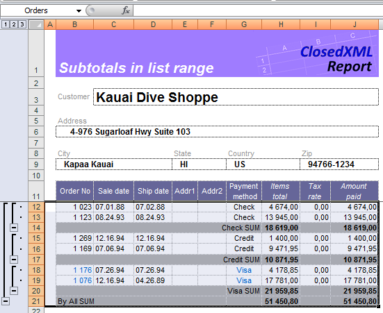
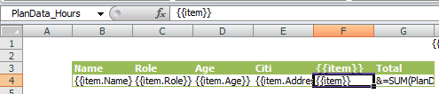
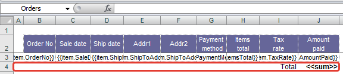

# Flat Tables

Variables or their properties of type `IEnumerable` may be bounded to regions (_flat tables_). To output all values from `IEnumerable` you should create a named range with the same name as variable. ClosedXML.Report searches named ranges and maps variables to them. To establish binding to properties of collection elements use built-in name `item`.

There are certain limitations on range configuration:
* Range can only be rectangular
* Range must not have gaps
* Cells in ranges may store normal text, ClosedXML.Report _expressions_ (in double curly braces), standard Excel formulas, and formulas escaped with `&` character
* Cells in ranges may be empty


### Range names
<a name="Range-names"></a>
While building a document ClosedXML.Report finds all named ranges and determines a data sources by their names. Range name should coincide with the name of the variable serving a data source for this range. For nested tables, range name is built using underscore (`_`). E.g. to output values from `Customers[].Orders[].Items[]` the range name must be `Customers_Orders_Items`. This example may be found in the [sample template]({{ site.github.repository_url }}/blob/develop/tests/Templates/Subranges_Simple_tMD1.xlsx).

### Expressions within tables
To work with tabular data, ClosedXML.Report introduces special variables that you can use in expressions inside tables:
* `item` - element from the list.
* `index` - the index of the element in the list (starts with 0).
* `items` - the entire list of items.

## Vertical tables

**Requirements for vertical tables**

Each range specifying the vertical table must have at least two columns and two rows. The leftmost column and the bottom row serve to configuration purposes and are treated the special way. After the report is built the service column is cleared, and the service row is deleted if it is empty.

When dealing with vertical tables CLosedXML.Report acts this way:
* The required number of rows is inserted in the region. Pay attention that cells are added to the range only, not to the entire worksheet. That means, regions located to the right or left of the table won't be affected.
* Contents of the added cells are filled with data according to template (static text, formulas or _expressions_).
* Styles from the template are applied to the inserted cells.
* Template cells are deleted.
* If the service row does not contain any options it is deleted too.
* If there are options defined in the service row they are processed accordingly, and then the row is either cleared or deleted.

Take a look into example from the [start page]({{ site.github.repository_url }}). As you can see on the picture, there is a range named `Orders` including a single row with _expressions_, a service row and a service column.


We applied custom styles to the cells in the range, i.e. we specified date formats for cells `SaleDate` and `ShipDate` and number formats with separators for cells `Items total` и `Amount paid`. In addition, we applied a conditional format to the `Payment method` cell.

To build a report from the template you simply have to run this code:
```
...
        var template = new XLTemplate('template.xslx');
        var cust = db.Customers.GetById(10);

        template.AddVariable(cust);
        template.Generate();
...

public class Customer
{
    ...
    public List<order> Orders { get; set; }
}

public class order
{
	public int OrderNo { get; set; } 
	public DateTime? SaleDate { get; set; } // DateTime
	public DateTime? ShipDate { get; set; } // DateTime
	public string ShipToAddr1 { get; set; } // text(30)
	public string ShipToAddr2 { get; set; } // text(30)
	public string PaymentMethod { get; set; } // text(7)
	public double? ItemsTotal { get; set; } // Double
	public double? TaxRate { get; set; } // Double
	public double? AmountPaid { get; set; } // Double
}
```

On the picture below you see the report produced from the specified template. Note that selected area now contains the data and is named `Orders`. You can use this name to access data in the result report.



## Horizontal tables

Horizontal tables do not have such strict requirements as vertical tables do. The named range consisting of a single row (in other words, does not contain an options row) it is assumed to be a horizontal. The horizontal one does not need to have a service column either. In fact, the horizontal table may be defined by a single cell. To explicitly define a range as a horizontal table definition put a special tag `<<Range horizontal>>` into any cell inside the range. You may find the example using the horizontal range [on the GitHub]({{ site.github.repository_url }}/blob/develop/tests/Templates/4.xlsx).

There two ranges in that template - `dates` and `PlanData_Hours`. Each of these ranges consist of one cell. As has been said, ClosedXML.Report treats such ranges as horizontal table definitions.



The result report:


## Service row

ClosedXML.Report offers nice features for data post-processing on building report: it sort the data, calculate totals by columns, apply grouping, etc. Which actions to perform may be defined by putting special _tags_ to the template. _Tag_ is a keyword put into double angle brackets along with configuration options. Tags controlling data in tables should be placed in the service row of the table template. Some of the tags are aplied to the range as a whole, the others affect only a column they are put in.

We will give detailed information on tags usage in the next chapters.

Now consider the following template. 



The cell in the service row in the `Amount paid` column contains the tag `<<sum>>`. The cell next to it contains a static text "Total". After the report is built the tag `<<sum>>` will be replaced with a formula calculating the sum of the amounts of the entire column. Tag `<<sum>>` belongs to the "column" tags. Such tags are applied to the column they are put in. Other examples of the "column" tags are `<<sort>>` that defines the ordering of the data set by the specified column, or `<<group>>` configuring grouping by the specified field.

Actions that must be performed on the whole range are defined with "range" tags. They are defined in the first (leftmost) cell of the service row. You may experiment a little with the described template. Try to open it and write tags `<<Autofilter>> <<OnlyValues>>` into the first cell of the service row. After you saved the template and rebuilt the report you may see that now it has the auto-filter turned on, and the formula `=SUBTOTAL(9, ...` in the `Amount paid` column has been replaced with the static value.
