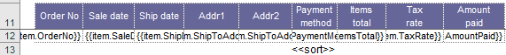
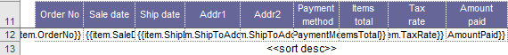
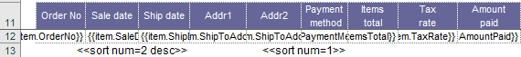

# Sorting a list range

Regions in ClosedXML.Report may be sorted by columns. This can be done by using tag `<<sort>>` in a service row of target columns.

You may choose the descending order by adding the parameter `desc` to the tag (`<<sort desc>>`). When the report is built you'll see the data sorted in the descending order.

Besides, you are able to specify the order different columns are sorted by adding the parameter `num` to the tag `sort` (`<<sort num=2>>`). On the picture below you may see the dataset will be sorted first by the column Payment Method, and then by the column Ship Date in the descending order.

Sorting in ClosedXML.Report has a certain limitation: all the data of the range to order must be located in a single row. If this is not a option for you consider sorting your data before transferring it to ClosedXML.Report.