### Простой шаблон
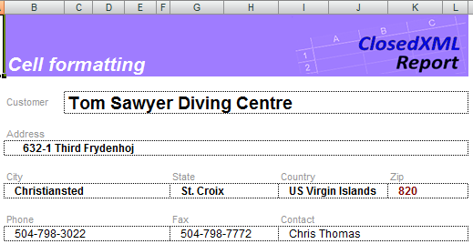

Вы можете применять к ячейкам любое форматирование, включая условные форматы.

Шаблон: [Simple.xlsx]({{ site.github.repository_url}}/blob/develop/tests/Templates/Simple.xlsx)

Результат: [Simple.xlsx]({{ site.github.repository_url}}/blob/develop/tests/Gauges/Simple.xlsx)

### Сортировка списка
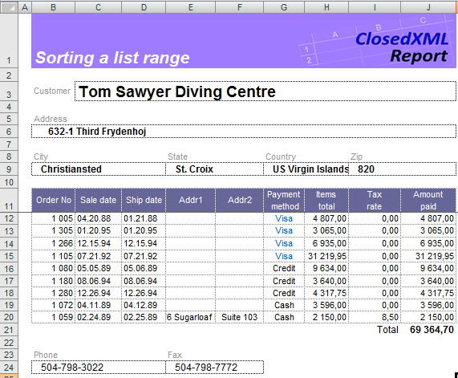

Вы можете отсортировать список по столбцам. Просто укажите тэг `<<sort>>` в ячейках опций соответствующих столбцов. Чтобы отсортировать в порядке убывания, добавьте опцию «Desc» в параметр тэга сортировки (`<<sort desc>>`). 

Подробнее смотрите раздел [Сортировка данных](Sorting)

Шаблон: [tLists1_sort.xlsx]({{ site.github.repository_url}}/blob/develop/tests/Templates/tLists1_sort.xlsx)

Результат: [tLists1_sort.xlsx]({{ site.github.repository_url}}/blob/develop/tests/Gauges/tLists1_sort.xlsx)

### Итоги по столбцам
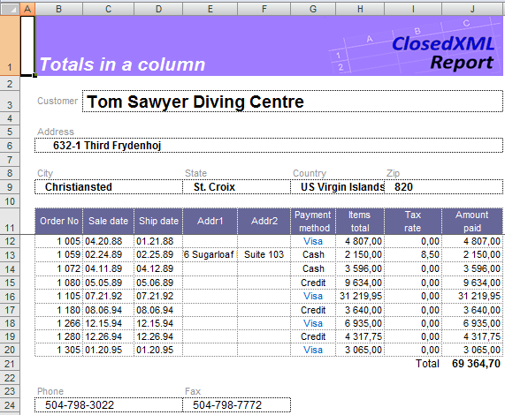

Вы можете получить итоговые значения для столбца диапазона, указав соответствующий параметр в ячейке опции столбца. 
В этом примере мы использовали тэг `<<sum>>` в строке опций списка для колонки Amount paid.

Подробнее смотрите раздел [Подитоги по столбцам](Totals-in-a-column).

Шаблон: [tlists2_sum.xlsx]({{ site.github.repository_url}}/blob/develop/tests/Templates/tlists2_sum.xlsx)

Результат: [tlists2_sum.xlsx]({{ site.github.repository_url}}/blob/develop/tests/Gauges/tlists2_sum.xlsx)

### Опции списка и колонок
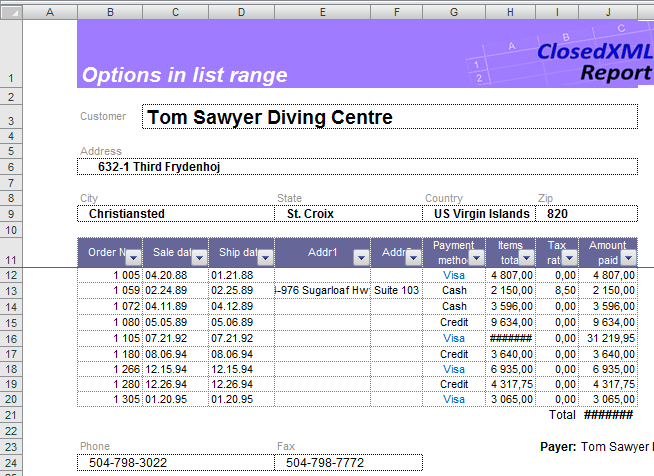

Помимо передачи данных из набора данных в диапазон, ClosedXML.Report может сортировать диапазон, составлять итоговые значения, группировать диапазон и так далее. Эти действия выполняются ClosedXML.Report, если он находит тэги диапазона и тэги столбца в соответствующих ячейках. 

Подробнее смотрите раздел [Плоские таблицы](Flat-tables)

В этом примере мы выравняли колонки по содержимому, добавили фильтры в заголовок таблицы, заменили формулы на значения и защитили колонку Amount paid от изменения. Для этого мы использовали тэги: <<AutoFilter>>, <<ColsFit>>, <<OnlyValues>> и <<Protected>>.

Шаблон: [tlists3_options.xlsx]({{ site.github.repository_url}}/blob/develop/tests/Templates/tlists3_options.xlsx)

Результат: [tlists3_options.xlsx]({{ site.github.repository_url}}/blob/develop/tests/Gauges/tlists3_options.xlsx)

### Сложный диапазон
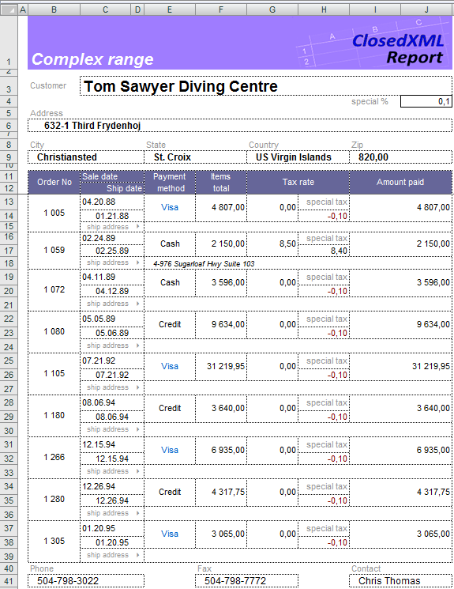

ClosedXML.Report способен использовать многострочные шаблоны для строки таблицы. Вы можете произвольным образом форматировать ячейки, объединять их, использовать условное форматирование, формулы Excel.

Подробнее смотрите раздел [Плоские таблицы](Flat-tables)

Шаблон: [tlists4_complexrange.xlsx]({{ site.github.repository_url}}/blob/develop/tests/Templates/tlists4_complexrange.xlsx)

Результат: [tlists4_complexrange.xlsx]({{ site.github.repository_url}}/blob/develop/tests/Gauges/tlists4_complexrange.xlsx)

### Группировка списка
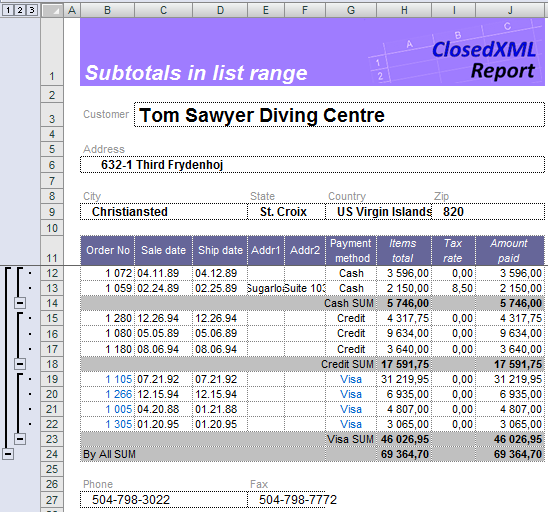

С тэгом `<<group>>` могут использоваться все тэги суммирования. Укажите опцию `<<group>>` в ячейках опций столбцов, где вы хотите получить промежуточные итоги.

Подробнее смотрите раздел [Группировка](Grouping)

Шаблон: [grouptagtests_simple.xlsx]({{ site.github.repository_url}}/blob/develop/tests/Templates/grouptagtests_simple.xlsx)

Результат: [grouptagtests_simple.xlsx]({{ site.github.repository_url}}/blob/develop/tests/Gauges/grouptagtests_simple.xlsx)

### Схлопнутые группы
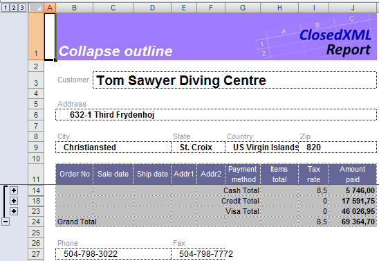

Используйте параметр collapse тэга group (`<<group collapse>>`), если вы хотите быстро отображать только строки, которые содержат сводки или заголовки для разделов вашего листа.

Подробнее смотрите раздел [Группировка](Grouping)

Шаблон: [grouptagtests_collapse.xlsx]({{ site.github.repository_url}}/blob/develop/tests/Templates/grouptagtests_collapse.xlsx)

Результат: [grouptagtests_collapse.xlsx]({{ site.github.repository_url}}/blob/develop/tests/Gauges/grouptagtests_collapse.xlsx)

### Заголовки над данными
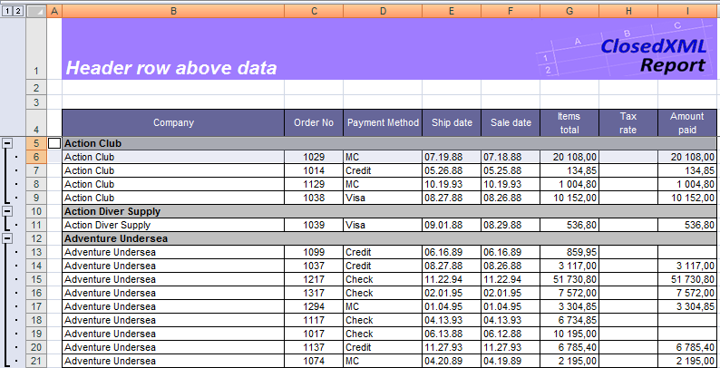

ClosedXML.Report реализует тэг SUMMARYABOVE. Он помещает строку итогов над сгруппированными данными. 

Подробнее смотрите раздел [Группировка](Grouping)

Шаблон: [grouptagtests_summaryabove.xlsx]({{ site.github.repository_url}}/blob/develop/tests/Templates/grouptagtests_summaryabove.xlsx)

Результат: [grouptagtests_summaryabove.xlsx]({{ site.github.repository_url}}/blob/develop/tests/Gauges/grouptagtests_summaryabove.xlsx)

### Объединение заголовков (вариант 1)
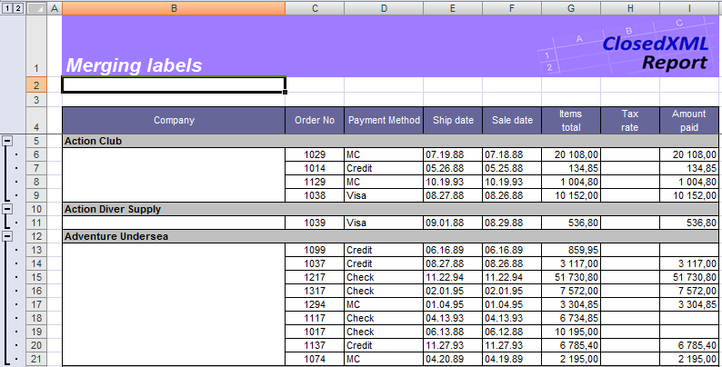

Тэг `<<group>>` позволяет объединять ячейки в сгруппированном столбце. Эта функция доступна с помощью параметра 'mergelabels' тэга `<<group>>`.

Подробнее смотрите раздел [Группировка](Grouping)

Шаблон: [grouptagtests_mergelabels.xlsx]({{ site.github.repository_url}}/blob/develop/tests/Templates/grouptagtests_mergelabels.xlsx)

Результат: [grouptagtests_mergelabels.xlsx]({{ site.github.repository_url}}/blob/develop/tests/Gauges/grouptagtests_mergelabels.xlsx)

### Объединение заголовков (вариант 2)
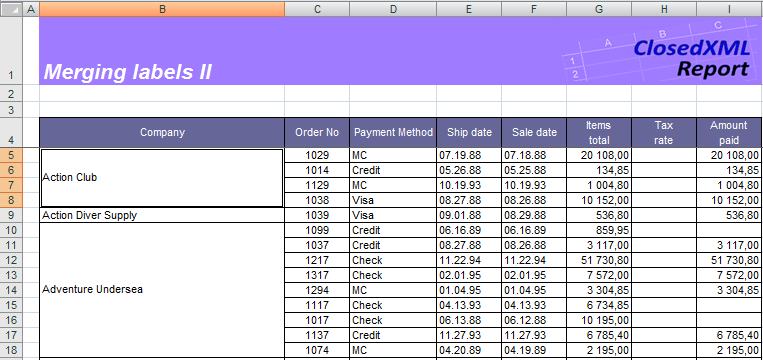

Тэг `<<group>>` позволяет группировать данные без вставки строки заголовка группы. Эта функция доступна с помощью параметра 'MergeLabels=Merge2' тэга `<<group>>`. Ячейки, содержащие сгруппированные данные, объединяются, а ячейка результата содержит сгруппированное значение.

Подробнее смотрите раздел [Группировка](Grouping)

Шаблон: [grouptagtests_mergelabels2.xlsx]({{ site.github.repository_url}}/blob/develop/tests/Templates/grouptagtests_mergelabels2.xlsx)

Результат: [grouptagtests_mergelabels2.xlsx]({{ site.github.repository_url}}/blob/develop/tests/Gauges/grouptagtests_mergelabels2.xlsx)

### Вложенные группы
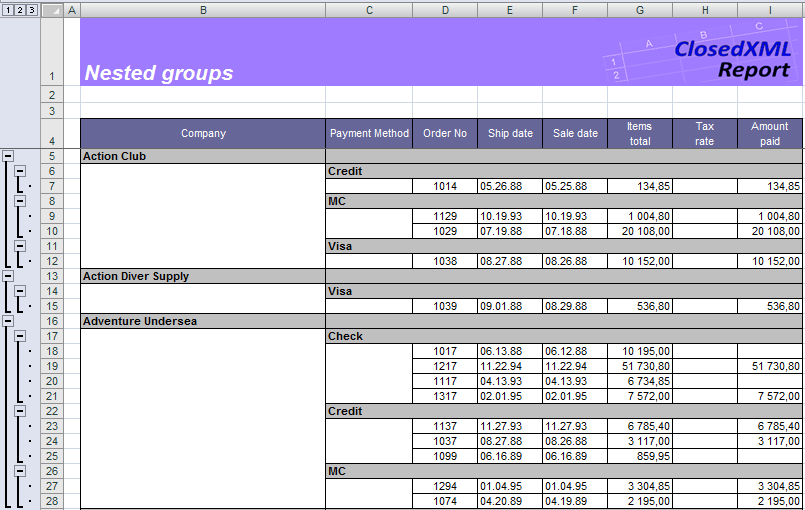

Списки могут быть сгруппированы с любым уровнем вложенности.

Подробнее смотрите раздел [Группировка](Grouping)

Шаблон: [grouptagtests_nestedgroups.xlsx]({{ site.github.repository_url}}/blob/develop/tests/Templates/grouptagtests_nestedgroups.xlsx)

Результат: [grouptagtests_nestedgroups.xlsx]({{ site.github.repository_url}}/blob/develop/tests/Gauges/grouptagtests_nestedgroups.xlsx)

### Отключенное схлопывание групп
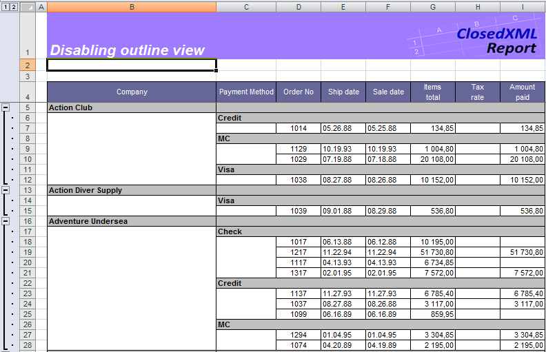

Используйте параметр `disableoutline` тэга `<<group>>` чтобы отключить схлопывание групп. В этом примере диапазон группируется по колонке Company и Payment method. Схлопывание групп столбца Payment method отключено.

Подробнее смотрите раздел [Группировка](Grouping)

Шаблон: [grouptagtests_disableoutline.xlsx]({{ site.github.repository_url}}/blob/develop/tests/Templates/grouptagtests_disableoutline.xlsx)

Результат: [grouptagtests_disableoutline.xlsx]({{ site.github.repository_url}}/blob/develop/tests/Gauges/grouptagtests_disableoutline.xlsx)

### Размещение заголовка группы
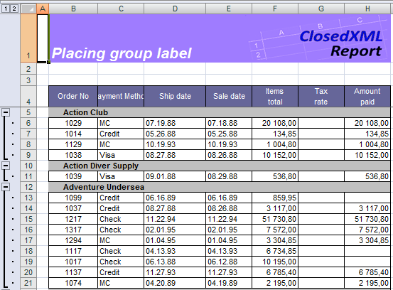

Тэг `<<group>>` позволяет размещать заголовок группы в любой столбец сгруппированного диапазона с помощью параметра `PLACETOCOLUMN=n`, где n - номер столбца в диапазоне (начиная с 1). Так же ClosedXML.Report содержит тэг `<<delete>>`, позволяющий удалить столбец или строку. В примере группировка выполняется по колонке Company с использованием параметра `mergelabels`. Заголовок группы столбца Company помещается во второй столбец диапазона (параметр `PLACETOCOLUMN=2`). Затем удаляется столбец Company.

Подробнее смотрите раздел [Группировка](Grouping)

Шаблон: [grouptagtests_placetocolumn.xlsx]({{ site.github.repository_url}}/blob/develop/tests/Templates/grouptagtests_placetocolumn.xlsx)

Результат: [grouptagtests_placetocolumn.xlsx]({{ site.github.repository_url}}/blob/develop/tests/Gauges/grouptagtests_placetocolumn.xlsx)

### Формулы в строке группы
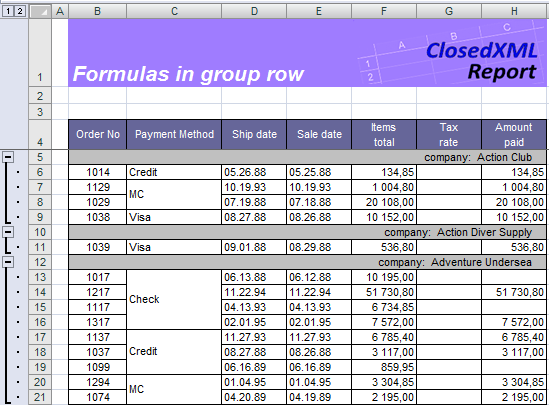

ClosedXML.Report сохраняет весь текст в ячейках строки параметров, если он не распознаёт его тэгом. Используйте эту возможность для размещения формул Excel в строке параметров. 
В примере выполняется группировка по полю Company и Payment method. В ячейке опций столбца Amount Paid есть формула Excel.

Подробнее смотрите раздел [Группировка](Grouping)

Шаблон: [grouptagtests_formulasingrouprow.xlsx]({{ site.github.repository_url}}/blob/develop/tests/Templates/grouptagtests_formulasingrouprow.xlsx)

Результат: [grouptagtests_formulasingrouprow.xlsx]({{ site.github.repository_url}}/blob/develop/tests/Gauges/grouptagtests_formulasingrouprow.xlsx)

### Группировка с заголовками
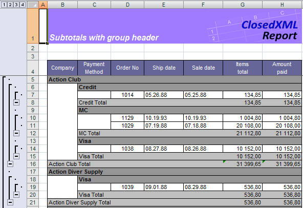

Вы можете настроить отображение заголовка группы с помощью параметра `WITHHEADER` тэга `<<group>>`. В этом случае заголовок группы помещается над сгруппированными данными и сводной строкой ниже данных. Параметр `SUMMARYABOVE` не влияет на это размещение. 

Подробнее смотрите раздел [Группировка](Grouping)

Шаблон: [grouptagtests_withheader.xlsx]({{ site.github.repository_url}}/blob/develop/tests/Templates/grouptagtests_withheader.xlsx)

Результат: [grouptagtests_withheader.xlsx]({{ site.github.repository_url}}/blob/develop/tests/Gauges/grouptagtests_withheader.xlsx)

### Вложенные области
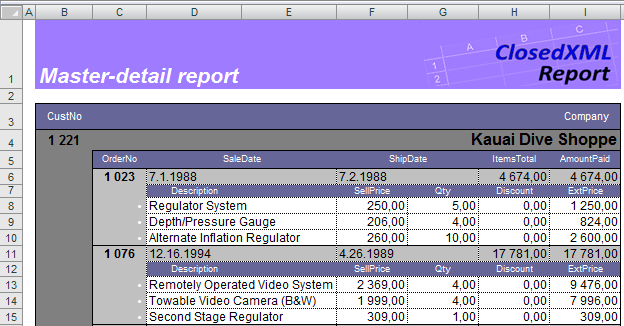

Вы можете вложить диапазон в другой диапазон, отражающий таким образом подчиненные отношения ваших данных. В примере диапазон Items вложен в Orders, а последний - в Customers. Все три диапазона имеют собственную строку параметров плюс ту же левую границу и ту же ширину.

Подробнее смотрите раздел [Вложенные области: отчет с детализацией](Nested-ranges_-Master-detail-reports).

Шаблон: [subranges_simple_tmd1.xlsx]({{ site.github.repository_url}}/blob/develop/tests/Templates/subranges_simple_tmd1.xlsx)

Результат: [subranges_simple_tmd1.xlsx]({{ site.github.repository_url}}/blob/develop/tests/Gauges/subranges_simple_tmd1.xlsx)

### Вложенные области с итогами
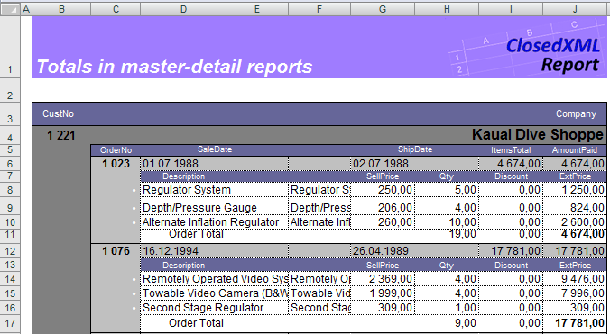

Вы можете использовать тэги суммирования на каждом уровне вложенности в отчете master-detail. В примере тэг `<<sum>>` в ячейке I9 будет суммировать ячейки `{{item.Discount}}` по заказу, в то время как тот же тэг в ячейке I10 суммирует эти ячейки по поставщику.

Подробнее смотрите раздел [Вложенные области: отчет с детализацией](Nested-ranges_-Master-detail-reports).

Шаблон: [subranges_withsubtotals_tmd2.xlsx]({{ site.github.repository_url}}/blob/develop/tests/Templates/subranges_withsubtotals_tmd2.xlsx)

Результат: [subranges_withsubtotals_tmd2.xlsx]({{ site.github.repository_url}}/blob/develop/tests/Gauges/subranges_withsubtotals_tmd2.xlsx)

### Вложенные области с внутренней сортировкой

Вы можете использовать тэг `<<sort>>` в самом внутреннем диапазоне.

Подробнее смотрите раздел [Вложенные области: отчет с детализацией](Nested-ranges_-Master-detail-reports).

Шаблон: [subranges_withsort_tmd3.xlsx]({{ site.github.repository_url}}/blob/develop/tests/Templates/subranges_withsort_tmd3.xlsx)

Результат: [subranges_withsort_tmd3.xlsx]({{ site.github.repository_url}}/blob/develop/tests/Gauges/subranges_withsort_tmd3.xlsx)

### Сводный отчёт
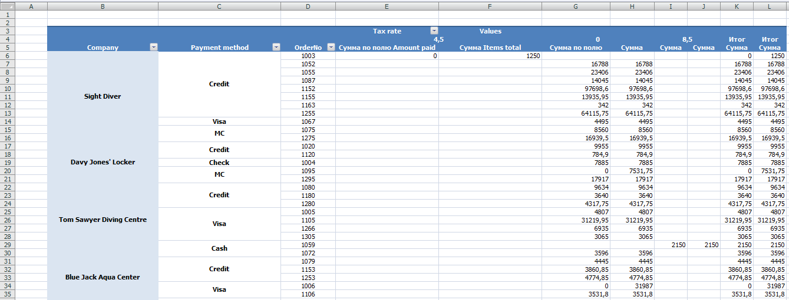

ClosedXML.Report поддерживает мощное средство работы со сводными таблицами. Вы можете разместить одну или несколько сводных таблиц прямо в шаблоне отчета, воспользовавшись удобством мастера сводных таблиц Excel и практически всеми возможностями в их оформлении и структурировании.

Подробнее смотрите раздел [Сводные таблицы](Pivot-tables).

Шаблон: [tpivot5_static.xlsx]({{ site.github.repository_url}}/blob/develop/tests/Templates/tpivot5_static.xlsx)

Результат: [tpivot5_static.xlsx]({{ site.github.repository_url}}/blob/develop/tests/Gauges/tpivot5_static.xlsx)
