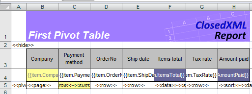
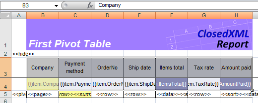

# Сводные таблицы

Для построения сводных таблиц достаточно указать в области данных тэги сводной таблицы. После этого эта область становится источником данных для сводной таблицы. Тэг `<<pivot>>` – это первый тэг, на который обращает внимание ClosedXML.Report при анализе ячеек области данных. Этот тэг может иметь несколько аргументов. Вот синтаксис:

`<<pivot Name=PivotTableName [Dst=Destination] [RowGrand] [ColumnGrand] [NoPreserveFormatting] [CaptionNoFormatting] [MergeLabels] [ShowButtons] [TreeLayout] [AutofitColumns] [NoSort]>>`

где:
* Name=PivotTableName – имя сводной таблицы, допустимое в Excel.
* Dst=Destination – ячейка, в которую необходимо поместить левый верхний угол сводной таблицы. Если Destination не указано, то сводная таблица автоматически размещается на новом листе книги.
* RowGrand – позволяет включить в сводной таблице итоги по строкам.
* ColumnGrand – включает итоги по столбцам сводной таблицы.
* NoPreserveFormatting – позволяет строить сводную таблицу без сохранения форматирования исходной области, что уменьшает время построения отчета.
* CaptionNoFormatting - форматирует заголовок сводной таблицы в соответствии с исходной таблицей.
* MergeLabels - позволяет объединить ячейки.
* ShowButtons - показывает кнопку, для сворачивания и разворачивания строк.
* TreeLayout - устанавливает режим сводной таблицы в виде дерева.
* AutofitColumns - включает автоподбор ширины колонок сводной таблицы.
* NoSort - запрещает автоматическую сортировку сводной таблицы.

Вот несколько примеров правильного написания опции Pivot:
* `<<pivot Name=Pivot1 Dst=Totals!A1>>` – будет создана сводная таблица с именем Pivot1; таблица
будет размещена на листе Totals начиная с ячейки A1;
* `<<pivot Name=Pivot25>>` – будет создана сводная таблица с именем Pivot25;
* `<<pivot Name=Pivot25 Dst=Totals!A1 RowGrand>>` – в сводной таблице Pivot25 включены итоги по
строкам данных;
* `<<pivot Name=Pivot25 ColumnGrand>>` – в сводной таблице Pivot25 включены итоги по столбцам.

Поля во все области сводной таблицы добавляются в порядке их следования в шаблоне (слева направо). Поэтому при проектировании области данных, по которой будет построена сводная таблица, нужно придерживаться одного простого
правила: выстраивайте столбцы в том порядке, в каком вы бы хотели видеть их в сводной таблице

### Важно!
Наименования полей для сводной таблицы берутся из строки над областью данных – заголовок таблицы источника. Будьте внимательны при создании этого заголовка, так как существуют некоторые ограничения по наименованию полей в сводных таблицах. С помощью сводных таблиц не составит никакого труда создавать в отчетах сложнейшие кросс-таблицы.

### Пример шаблона 

[Файл шаблона]({{ site.github.repository_url}}/blob/develop/tests/Templates/tPivot1.xlsx)

В левой нижней ячейке области с данными вписан тэг `<<pivot Name="OrdersPivot" dst="Pivot!B8" rowgrand mergelabels AutofitColumns>>`. Эта опция укажет ClosedXML.Report, что по области будет строиться сводная таблица с именем “OrdersPivot”, которая будет размещена на листе “Pivot”, начиная с ячейки B8. А параметр `rowgrand` позволит включить итоги по столбцам полученной сводной таблицы. В служебной ячейке столбцов “Payment method” , “OrderNo”, “Ship date” и “Tax rate” указан тэг `<<row>>`. Тэг `<<row>>` определяет поля области строк сводной таблицы. Для того чтобы получить итоги, сгруппированные по методу оплаты счетов, к тэгу `<<row>>` в поле “Payment method” добавлен тэг `<<sum>>`. Для полей “Amount paid” и “Items total” указан тэг `<<data>>` (поля области данных сводной таблицы). В опции поля “Company” добавлен тэг `<<page>>` (поле области страниц). При проектировании шаблона кроме распределения тэгов между столбцами не забудьте указать различные форматы ячейкам области (в том числе для ячеек с датами и числами). Более того, мы отформатировали служебные ячейки с опциями столбцов, подразумевая, что именно с этим форматом мы получим промежуточные итоги в сводной таблице. А для поля “Payment method” мы выделили ячейку с тэгами цветом. 

## Статические сводные таблицы
Вы можете разместить одну или несколько сводных таблиц прямо в шаблоне отчета, воспользовавшись удобством мастера сводных таблиц Excel и практически всеми возможностями в их оформлении и структурировании. Приведем пример. В качестве отправной точки используем [шаблон первого примера]({{ site.github.repository_url}}/blob/develop/tests/Templates/tPivot1.xlsx) со сводной таблицей с исходной областью Orders на листе Sheet1. Прямо в шаблоне мы поместили статическую сводную таблицу, построенной по этой области. На следующих рисунках показаны шаги построения этой таблицы. Во-первых, необходимо выделить для сводной таблицы исходную область. Она не идентична области Orders, так как включает только строку с данными и заголовок над ней. Обратите внимание, как выделена исходная область на рисунке: 

Далее мы поместили сводную таблицу на отдельном листе PivotSheet и распределили ее поля в области строк, столбцов и данных. Мы отформатировали поля сводной таблицы, а также их заголовки. В завершении мы назвали сводную таблицу именем PivotTable1, а в качестве опции исходной области мы указали `<<pivot>>`. После переноса данных все сводные таблицы, ссылающиеся на эту область данных, будут обновлены. То есть, по одной области вы можете построить несколько сводных таблиц.