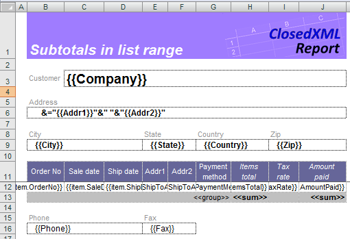
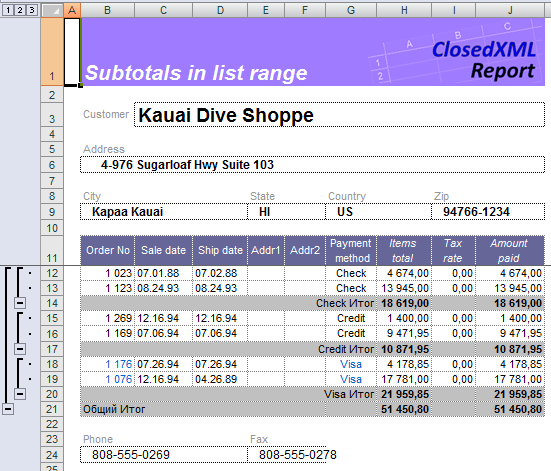

# Быстрый старт


ClosedXML.Report - это инструмент для создания отчетов и анализа данных в приложениях .NET с использованием Microsoft Excel. Это .NET-библиотека для создания отчетов Microsoft Excel, не требующая установки Excel на машине, на которой выполняется код. С помощью ClosedXML.Report вы можете легко экспортировать любые данные из ваших классов .NET в Excel с помощью XLSX-шаблона.

### Установка ClosedXML.Report через NuGet

Если вы хотите включить ClosedXML.Report в свой проект, вы можете [установить его непосредственно из NuGet](https://www.nuget.org/packages/ClosedXML.Report/)

Чтобы установить ClosedXML.Report, запустите следующую команду в консоли диспетчера пакетов

```
PM> Install-Package ClosedXML.Report
```
или если у вас подписанная сборка то:
```
PM> Install-Package ClosedXML.Report.Signed
```

## Особенности

* Копирование форматирования ячеек 
* Копирование условного форматирования
* Вертикальные и горизонтальные таблицы
* Возможность применения формул Excel 
* Использование динамически рассчитываемых формул с синтаксисом C# и Linq 
* Операции с табличными данными: сортировка, группировка, общие функции. 
* Сводные таблицы 
* Контроль за построением отчёта с помощью управляющих тэгов
* Вложенные области (master-detail) 

## Как использовать?
Чтобы создать отчет, вы должны сначала создать шаблон отчета. Вы можете применить любое форматирование к ячейкам рабочей книги, вставить изображения и изменить любой из параметров самой книги. В этом примере мы отключили отображение нулевых значений и спрятали линии сетки. ClosedXML.Report сохранит все изменения в шаблоне.
 

**Template**



**Code**

```c#
    protected void Report()
    {
        const string outputFile = @".\Output\report.xlsx";
        var template = XLWorkbook.OpenFromTemplate(@".\Templates\report.xlsx");

        using (var db = new DbDemos())
        {
            var cust = db.customers.LoadWith(c => c.Orders).First();
            template.AddVariable(cust);
            template.Generate();
        }

        template.SaveAs(outputFile);

        //Show report
        Process.Start(new ProcessStartInfo(outputFile) { UseShellExecute = true });
    }
```

**Result**



Для получения дополнительной информации см. [Документация](index) и [Тесты]({{ site.github.repository_url}}/tree/master/tests)
